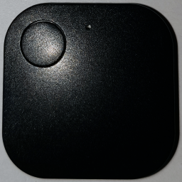
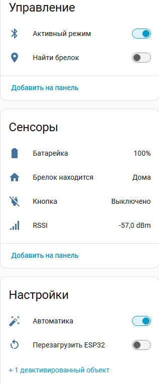

# iTAG BLE Tracker для Home Assistant

Полноценная интеграция для отслеживания BLE-устройств iTAG через ESP32 с поддержкой всех функций.

## Возможности

- 📍 **Отслеживание присутствия** - определение дома/не дома
- 🔘 **Кнопка** - мгновенная реакция на нажатие
- 🔋 **Батарея** - реальный уровень заряда (без заглушек)
- 📶 **RSSI** - уровень сигнала
- 🔊 **Звук** - функция "Найти брелок"
- 🤖 **Автоматический режим** - интеллектуальное управление подключением

## Принцип работы

ESP32 подключается к iTAG через BLE и передает все данные в Home Assistant через ESPHome.

Устройство работает в двух режимах:

| Функция | Активный режим | Пассивный режим |
|---------|---------------|-----------------|
| Присутствие | ✅ | ✅ |
| RSSI | ✅ (точный) | ✅ (из рекламных пакетов) |
| Кнопка | ✅ | ❌ |
| Батарея | ✅ | ❌ |
| Найти брелок | ✅ | ❌ |

**Пассивный режим** - ESP32 только слушает рекламные пакеты, экономя энергию.
**Активный режим** - ESP32 подключается к брелоку, получая все данные.

## Управление режимами

В Home Assistant доступны два переключателя:

### Активный режим
Ручное управление подключением к брелоку:
- **ВКЛ** - ESP32 подключен к iTAG, доступны все функции
- **ВЫКЛ** - ESP32 в пассивном режиме, только обнаружение

### Автоматика (в разделе "Настройки")
Управляет автоматическим переключением режимов:

| Автоматика | Активный режим | Поведение |
|------------|----------------|-----------|
| ✅ ВКЛ | ВЫКЛ | При обнаружении брелока → автоматически включится активный режим |
| ✅ ВКЛ | ВКЛ | При потере связи → автоматически выключится активный режим |
| ❌ ВЫКЛ | ВЫКЛ | При обнаружении брелока → НЕ включится активный режим |
| ❌ ВЫКЛ | ВКЛ | При потере связи → выключится активный режим (всегда) |

### Логика работы

- Автоматика влияет **только на автоматическое ВКЛЮЧЕНИЕ** активного режима
- Автоматическое ВЫКЛЮЧЕНИЕ при потере связи происходит **ВСЕГДА** (автоматика не влияет)
- При **ручном включении** активный режим включается независимо от автоматики
- При **ручном выключении** активный режим выключается и автоматика не включит его сама

### Рекомендуемые сценарии

**Сценарий 1: Полная автоматика (по умолчанию)**

- Автоматика: ВКЛ
- Активный режим: ВЫКЛ

Результат: Брелок сам подключается когда рядом и отключается когда уходит

**Сценарий 2: Только пассивное отслеживание**

- Автоматика: ВЫКЛ
- Активный режим: ВЫКЛ

Результат: Только определение рядом/не рядом, экономия батареи ESP32

**Сценарий 3: Постоянный контроль**

- Автоматика: ВЫКЛ
- Активный режим: ВКЛ

Результат: Всегда подключен, моментальная реакция на кнопку

## Установка

### 1. Прошивка ESP32

1. Установите аддон **ESPHome** в Home Assistant
2. Создайте новое устройство
3. Скопируйте конфигурацию ниже
4. Замените MAC-адрес на свой (найдите его в логах после первой загрузки)
5. Скомпилируйте и залейте прошивку

- 📄 [iTAG-ESPHOME.yaml](iTAG-ESPHOME.yaml) - Конфигурация ESPHome

### 2. Подключение к Home Assistant

После прошивки устройство автоматически появится в Home Assistant через ESPHome API.

## Сущности в Home Assistant

| Тип | Название | Описание |
|-----|----------|----------|
| Binary Sensor | Брелок находится | Присутствие (домой/не домой) |
| Binary Sensor | Кнопка | Статус нажатия кнопки |
| Sensor | RSSI | Уровень сигнала (dBm) |
| Sensor | Батарейка | Уровень заряда (%) |
| Switch | Активный режим | Ручное управление подключением |
| Switch | Найти брелок | Запустить звуковой сигнал |
| Switch | Автоматика | Вкл/выкл автоматический режим (в настройках) |
| Switch | Перезагрузить ESP32 | Перезагрузка устройства (в настройках) |

## Требования

- ESP32 (рекомендуется ESP32-C3 или любой другой)
- iTAG брелок 
- Home Assistant с ESPHome

## Решение проблем

### Не подключается к iTAG
1. Проверьте MAC-адрес в конфигурации
2. Убедитесь, что iTAG находится рядом
3. Попробуйте заменить батарейку в брелке (при недостаточном заряде, при нажатии кнопки брелок перезагружается)
4. Перезагрузите ESP32

### Кнопка не срабатывает
- Кнопка работает только в активном режиме
- Убедитесь что переключатель "Активный режим" включен

### Батарея не отображается
- Данные батареи доступны только в активном режиме
- Включите активный режим и подождите обновления (до 5 минут)

## Лицензия

MIT

## Автор

[NagibinA](https://github.com/NagibinA)
